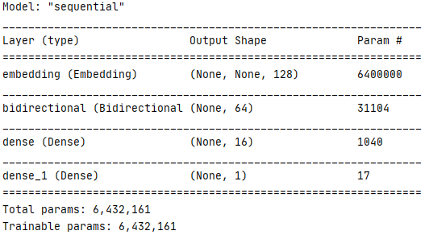
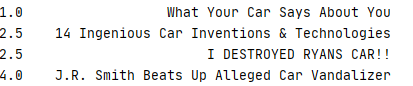

# Score YouTube Titles

**This is a RNN model that ranks a list of YouTube video titles for the potential of maximizing views.**

## Dependencies

> `tensorflow 2.1.0`\
> `pandas 1.04`\
> `selenium 3.1` for extracting trainning data

## Model Architecture

## Training Data

`data.csv` contains 40k raw data collected from YouTube. Feel free to use `yt-data-extraction.py` to collect more training data.

The data is collected by searching through a list of keywords on YouTube and scrape the top 25 results. You can add more search terms
to the `search_terms` file. It will repeatedly run a headless selenium driver process to search YouTube. 

## Usage

To train the model, simply run `python train.py`

To test some titles simply run `python test.py "What Your Car Says About You" "J.R. Smith Beats Up Alleged Car Vandalizer" "14 Ingenious Car Inventions & Technologies" "I DESTROYED RYANS CAR!!"`

Here is the result of running the test script.\

The result is a rank of the titles by their potential for views. 

